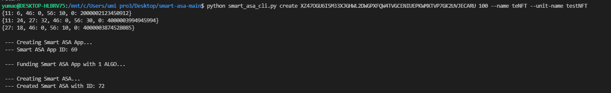
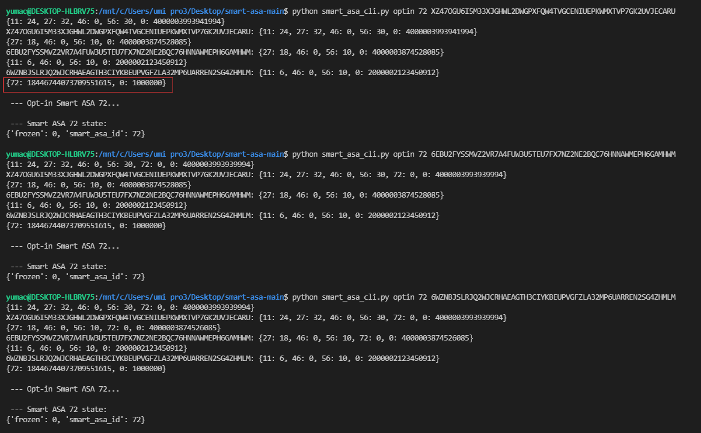
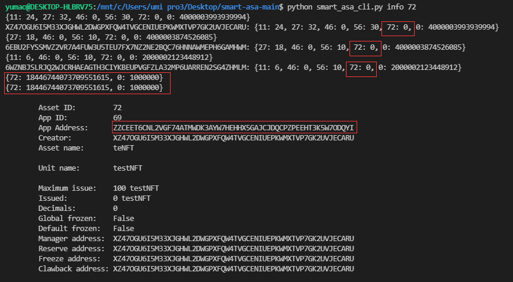
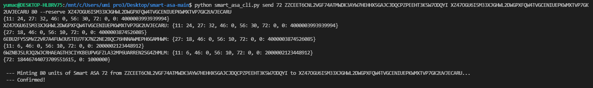
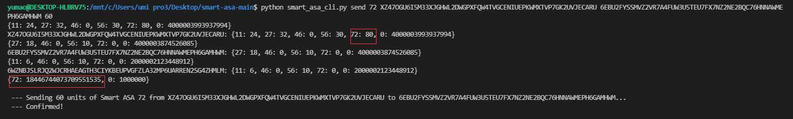
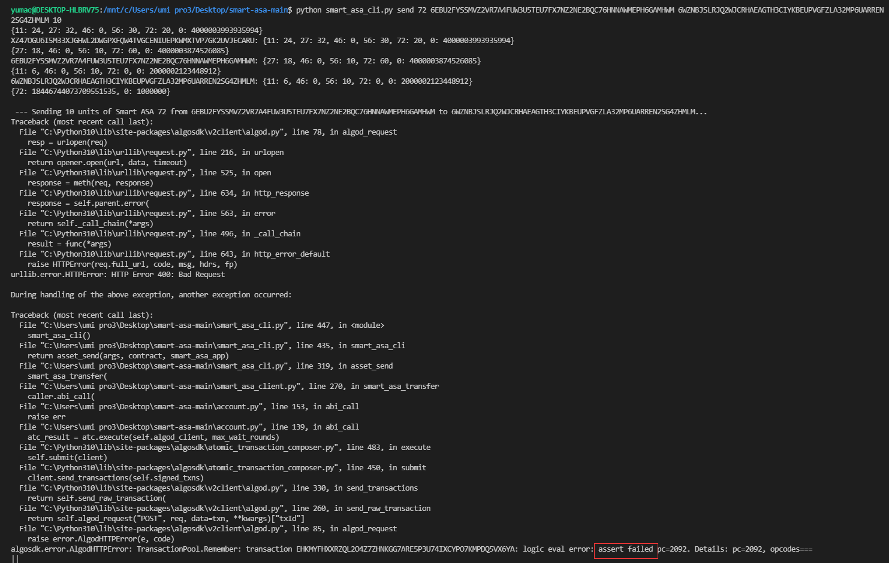
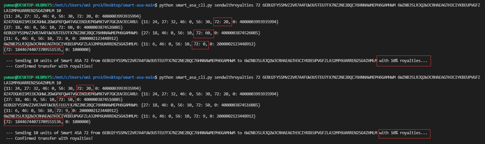
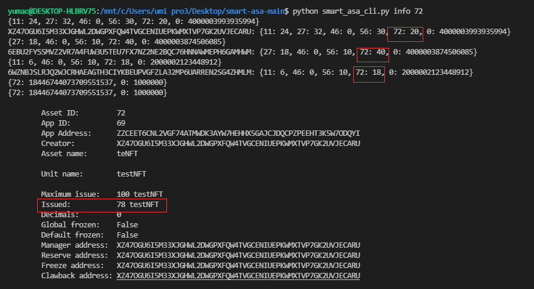

## Overview
"The Smart ASA introduced with ARC-0020 represents a new building block for blockchain applications. It offers a more flexible way to work with ASAs providing re-configuration functionalities and the possibility of building additional business logic around operations like asset transfers, royalties, role-based transfers, limit-amount-transfers, mints, and burns. "

This project aims to build a demo of an NFT ticketing system using the Smart ASA with ARC-0020, which supports customized asset transfer methods including royalties and discounts. 

## A better NFT ticketing system using ARC-0020
Relying on the encryption and anti-counterfeiting capabilities provided by the Algorand blockchain, NFT can easily realize data transparency, non-forgeability, non-duplication, and controllable circulation. In the real world, we have noticed that movie tickets, zoo tickets, and park annual tickets can all be regarded as vouchers with unique IDs in essence. Based on this feature, NFT is very suitable for the ticket market.

Someone may have such a question: the existing ticket market has realized online ticket purchase, online payment, and QR code ticket verification, which is a good experience, is there any need to improve?

In fact, the existing ticketing systems are scattered and centralized. For example, there are many online platforms and systems which sell movie tickets, however, these systems cannot be interconnected. If every theater or cinema needs to connect with so many ticketing systems, the IT cost for those will be very high.

In addition, cinemas cannot reach those users directly because of these third-party systems that users are directly facing, even a discount message cannot be pushed to users by these cinemas.

So how do we solve the problem? The NFT technology based on blockchain is an effective measure to reduce the IT cost of the ticketing system. All the existing ticketing systems will never share the user and ticket purchasing data as their own private data storage. On the contrary, NFT data is open and transparent on the chain. Any theater or cinema only needs to distribute all movie tickets of a movie on the blockchain in the form of NFT, which is equivalent to completing the "registration and distribution" of the primary market. Any third-party ticketing system, even individuals, can sell NFT movie tickets of the primary market to other users, which is called "secondary market sales". Since NFT tickets cannot be forged, there is no fake ticket problem. The cinema itself does not rely on any third-party system for ticket verification. It can verify NFT movie tickets by itself only by synchronizing blockchain data.

Because NFT is also programmable, especially as we implement the ticking system with ARC-0020, the publisher can completely customize the primary sales and secondary sales rules. For example, some tickets are not allowed to be transferred, and some tickets can be transferred, but a certain handling fee or royalties will be charged. These flexible rules do not need to be defined by third parties, and the issuer can create them in the form of a smart contract.

Finally, because the distribution and circulation data of NFT are completely transparent, cinemas can analyze their own user data to improve their services to users. 

To sum up, an ARC0020-based ticketing system will have the following significant advantages:
Security: Each NFT ticket has the characteristics of traceability, anti-counterfeiting, and verifiability;
Low cost: The issuer does not need to integrate with multiple third-party ticketing systems, and any third party with technical and sales capabilities can act as a sales channel;
Transparency: All transaction data is stored on the blockchain, and the data is no longer proprietary to a third party.

## Implementation in this project
This implementation is based on https://github.com/algorandlabs/smart-asa, I create new contract methods to allow transfer with royalties and role-checking. Specifically, the customized loyalty rate is 0.1, which means sending 10 tickets will actually send only 9 tickets and the other 1 ticket is sent back to the smart contract. This could be customized, either the rate or the asset of royalties. For example, you can use Algo as the royalty charing asset, and you can set the royalty rate per ticket, for instance, 1 Algo per ticket. What's more, a transfer without royalties can only be called by the asset manager/issuer/creator.

The method of royalty transfer in is shown below: 

In smart_asa_asc:
```
def smart_asa_transfer_inner_txn_with_royalties(
    smart_asa_id: Expr,
    asset_amount: Expr,
    asset_sender: Expr,
    asset_receiver: Expr,
) -> Expr:
    return Seq(
        InnerTxnBuilder.Begin(),
        InnerTxnBuilder.SetFields(
            {
                TxnField.fee: Int(0),
                TxnField.type_enum: TxnType.AssetTransfer,
                TxnField.xfer_asset: smart_asa_id,
                TxnField.asset_amount: asset_amount/Int(10)*Int(9),
                TxnField.asset_sender: asset_sender,
                TxnField.asset_receiver: asset_receiver,
            }
        ),
        InnerTxnBuilder.Submit(),
        InnerTxnBuilder.Begin(),
        InnerTxnBuilder.SetFields(
            {
                TxnField.fee: Int(0),
                TxnField.type_enum: TxnType.AssetTransfer,
                TxnField.xfer_asset: smart_asa_id,
                TxnField.asset_amount: asset_amount/Int(10),
                TxnField.asset_sender: asset_sender,
                TxnField.asset_receiver: App.globalGet(GlobalState.manager_addr),
            }
        ),
        InnerTxnBuilder.Submit(),
    )
```
You could customize the asset and rate of royalty here in the smart contract. 

For calling the method (in smart_asa_cli): 
```
def asset_send_with_royalties(
    args: dict,
    contract: Contract,
    smart_asa_app: AppAccount,
) -> None:
    if args["--reserve"]:
        caller = Sandbox.from_public_key(args["--reserve"])
        if (
            args["<to>"] == args["--reserve"]
            and args["<from>"] == smart_asa_app.address
        ):
            action = "Minting"
        elif (
            args["<to>"] == smart_asa_app.address
            and args["<from>"] == args["--reserve"]
        ):
            action = "Burning"
        else:
            action = "Sending"
    elif args["--clawback"]:
        caller = Sandbox.from_public_key(args["--clawback"])
        action = "Clawbacking"
    else:
        caller = Sandbox.from_public_key(args["<from>"])
        action = "Sending"

    print(
        f"\n --- {action} {args['<amount>']} units of Smart ASA "
        f"{args['<asset-id>']} from {args['<from>']} to "
        f"{args['<to>']}..."
    )
    smart_asa_transfer_with_royalties_ten_percent(
        smart_asa_contract=contract,
        smart_asa_app=smart_asa_app,
        xfer_asset=args["<asset-id>"],
        asset_amount=args["<amount>"],
        caller=caller,
        asset_receiver=args["<to>"],
        asset_sender=args["<from>"],
    )
    return print(f" --- Confirmed Royalties transfer!\n")
```
This method will then call the `smart_asa_transfer_with_royalties_ten_percent` method in smart_asa_client:

```
def smart_asa_transfer_with_royalties_ten_percent(
    smart_asa_contract: Contract,
    smart_asa_app: AppAccount,
    xfer_asset: int,
    asset_amount: int,
    caller: Account,
    asset_receiver: Account,
    asset_sender: Optional[Union[str, Account]] = None,
    save_abi_call: Optional[str] = None,
) -> None:

    params = get_params(caller.algod_client)
    abi_call_fee = params.fee * 10

    caller.abi_call(
        smart_asa_contract.get_method_by_name("asset_transfer_with_royalties_ten_percent"),
        xfer_asset,
        asset_amount,
        caller if asset_sender is None else asset_sender,
        asset_receiver,
        app=smart_asa_app,
        fee=abi_call_fee,
        save_abi_call=save_abi_call,
    )
```

The method of transfer with role-checking (no royalties) in is shown below (related part):
```
    ...
    is_control_roles = Or(
        asset_sender.address() == App.globalGet(GlobalState.reserve_addr),
        asset_sender.address() == Global.current_application_address(),
    )
    ...
    =============================================
    ...
    If(is_not_clawback)
        .Then(
            # Asset Regular Transfer Preconditions
            Assert(
                Not(asset_frozen),
                Not(asset_sender_frozen),
                Not(asset_receiver_frozen),
                is_current_smart_asa_id,
                is_control_roles
            ),
        )
    ...
```

The other related parts or methods are pretty similar to those of transferring assets with royalties, but without the inner transaction for royalties in the construction method of the inner transaction method for asset transfer

## Demo: (see test.txt for commands for CLI)
1. Set up the environment for the sandbox
2. Create the asset with ARC-0020 standard
3. Opt-in three accounts/addresses(one of the account has to be the creator of the asset) to the created asset
4. Show the information of the smart ASA
4. Mint assets using the creator's account/address
5. The creator transfer asset to one of the remaining accounts using send method without royalties (no royalty is charged but identity checking is required, which means only the creator could transfer the asset without royalties, which corresponds to primary market sales)
6. The receiver of the assets then transfers some of the assets to the other account that does not have the asset, and 10% of the transferred assets will be sent back to the smart contract as a charge(which corresponds to secondary market sales with royalty)

### 1. Setup the enviroment (WSL in my device)
#### Command
`cd sandbox`
`./sandbox up`
`pipenv install` 
#### Demo

#### Explanation
In order to run the code in the local environment, please follow the instruction of Algorand Sandbox to set up the sandbox environment, you may choose the dev private network as the specific configuration as it is extremely useful for fast e2e testing of an application.
Sandbox: https://github.com/algorand/sandbox

In addition, you need to install the Smart ASA CLI by `pipenv install`. The CLI, as-is, is intended for testing purposes and can only be used within an Algorand Sandbox environment. Please refer to <a href="https://github.com/algorandlabs/smart-asa ">Smart-ASA</a>.

### 2. Create the asset with the account of ticket issuer
#### Command
`python smart_asa_cli.py create ISSUER_ADDRESS MAXIMUM_ISSUE --name YOUR_NFT_NAME --unit-name YOUR_UNIT_NAME`
#### Demo

#### Explanation
As you can see, there are currently 3 accounts and the three pairs of curly braces contain the asset balance corresponding to each account. In this section, I create a smart ASA named teNFT(also, asset-72) and fund the contract with 1 algo.

### 3. Opt-in the asset
#### Command
`python smart_asa_cli.py optin ASSET_ID ADDRESS`
#### Demo

#### Explanation
I opted all the accounts into the asset-72, to be able to receive and send it. You can also see there is one pair of curly brace which is noted with a red grid, that is the balance of the smart contract corresponds to the smart ASA. Currently, the amount of the asset-72 in this contract address is the max supply.

### 4. Get contract address
#### Command
`python smart_asa_cli.py info ASSET_ID `
#### Demo

#### Explanation
To mint the asset, we need to get the address of the smart contract, so here I just call the info method to get it.

### 5. Mint some assets
#### Command
`python smart_asa_cli.py send 72 CONTRACT_ADDRESS ADDRESS 80 --reserve ISSUER_ADDRESS`
#### Demo

#### Explanation
In this section, I mint 80 asset-72, using the issuer's address as the receiver and reserve address. In real life, this is the process of issuing tickets.

### 6. Send Asset (Role-based without royalties) - Success
#### Command
`python smart_asa_cli.py send 72 ISSUER_ADDRESS ADDRESS ASSET_AMOUNT`
#### Demo

#### Explanation
I send 60 asset-72 to one of the other two addresses (the receiver represents people who need tickets or who wanna sell tickets), the transfer is role-based without any royalties, it asserts if the transaction sender and the asset sender are the smart contract address or the issuer address if it is then the transaction could be submitted. This send method could be combined with an algo transaction to implement the ticket buying, thus, the issuer could customize the price of the ticket as well as a discount if there is any. 

### 7. Send Asset (Role-based without royalties) - Fail
#### Command
`python smart_asa_cli.py send 72 ADDRESS ADDRESS ASSET_AMOUNT`
#### Demo

#### Explanation
This section aims to provide a counterpart of the previous section: If a non-issuer address tries to send assets with the role-based send method, the transaction will fail.

### 8. Send Asset with royalties - Success
#### Command
`python smart_asa_cli.py sendwithroyalties 72 ADDRESS ADDRESS ASSET_AMOUNT`
#### Demo

#### Explanation
This section represents the secondary market of tickets in the real life, people could sell and transfer tickets to others and they are charged because of royalties. In the example that is illustrated by the screenshot, in transaction 1, the address 6EBU.. sends 10 asset-72 to address 6WZN.. with 10% royalties. Then in transaction 2, we could see the balances info in front of the transaction, which indicates that only 9 asset-72 are sent to address 6WZN.. and the other 1 is sent back to the contract address.

### 9. Review Smart ASA info
#### Command
`python smart_asa_cli.py info ASSET_ID `
#### Demo

#### Explanation
Let's see the balances of all addresses and the smart ASA info again, after two transfers with royalties, address 6WZN.. now have 18 asset-72. As I have minted 80 asset-72 using the issuer's account and 2 of them are sent back to the contract address as royalties, now the contract has totally issued 78 asset-72.


## Reference
- <a href="https://github.com/algorandfoundation/ARCs/blob/main/ARCs/arc-0020.md ">[arc-0020]</a>
- <a href="https://github.com/algorandlabs/smart-asa ">[Smart-ASA]</a>
- <a href="https://github.com/algorand/sandbox ">[Algorand-SandBox]</a>

